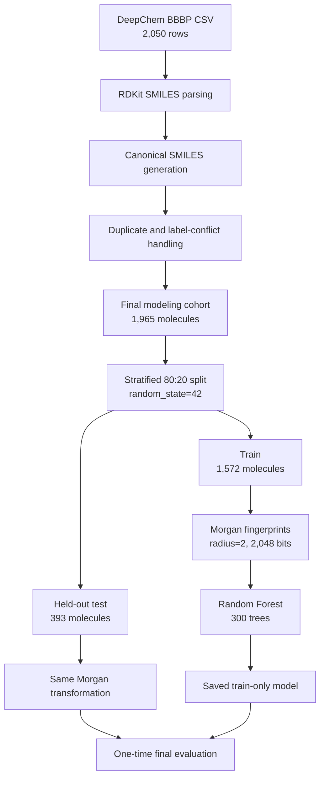
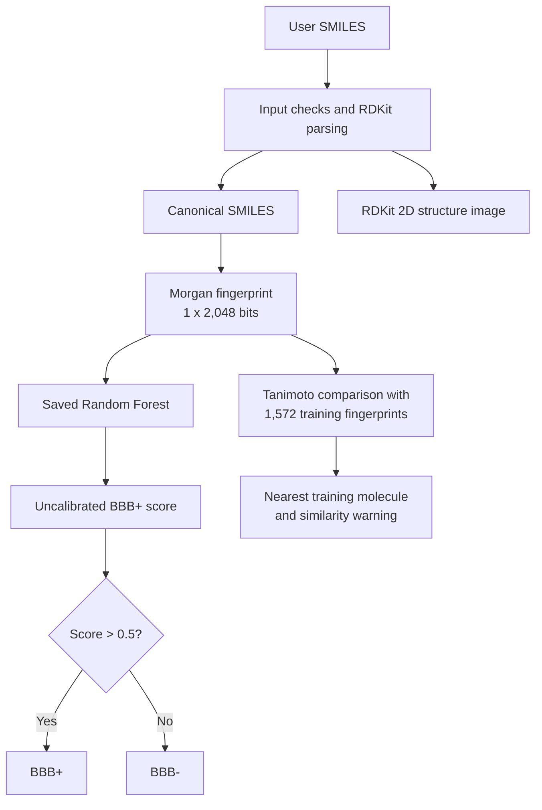

# SMILES-Based Blood-Brain Barrier Permeability Prediction

This educational research project predicts whether a molecule is more likely to be labeled BBB+ or BBB- from its SMILES representation. It uses the public MoleculeNet BBBP dataset, RDKit molecular features, three prespecified baseline models, and a deployed Streamlit application.

The deployed model is a Random Forest trained on 2,048-bit Morgan fingerprints. Its output is an uncalibrated classification score, not a measured blood-brain barrier passage probability, brain concentration, or clinical prediction.

## Live Demo

- [Open the Streamlit application](https://jwhan0301-bbbp-permeability-prediction.streamlit.app/)
- [View the GitHub repository](https://github.com/jwhan0301/bbbp-permeability-prediction)

The deployed application was checked for valid and invalid SMILES input, molecular structure rendering, saved-model inference, and nearest-training-molecule similarity output.


## Project at a Glance

- Audited all 2,050 rows in the public DeepChem BBBP CSV.
- Prepared 1,965 valid, non-conflicting, canonicalized molecules for modeling without modifying the source dataset.
- Used a stratified 80:20 train-test split with `random_state=42`.
- Compared a DummyClassifier, descriptor-based Logistic Regression, and Morgan fingerprint Random Forest on the same held-out test set.
- Selected the Random Forest because it produced the strongest Accuracy, F1-score, and ROC-AUC among the three prespecified baseline models.
- Deployed the saved Random Forest without retraining it inside the application.
- Added nearest-training-molecule Tanimoto similarity as contextual information; similarity does not determine the BBB prediction.

## Dataset and Modeling Cohort

The dataset is downloaded at runtime from the public URL specified by the official [DeepChem BBBP loader](https://github.com/deepchem/deepchem/blob/master/deepchem/molnet/load_function/bbbp_datasets.py). The raw BBBP CSV is not stored in this repository.

| Data-processing stage | Molecules |
|---|---:|
| Original BBBP rows | 2,050 |
| RDKit parsing failures excluded from modeling | 11 |
| Same-label duplicate rows excluded from modeling | 54 |
| Conflicting-label rows excluded from modeling | 20 |
| Final modeling cohort | **1,965** |

The original rows were retained for auditing. A parsing failure means that RDKit could not construct a molecular object, so molecular features could not be calculated. For duplicate canonical SMILES with the same label, the first source row was retained. If the same canonical SMILES had conflicting labels, the complete conflicting group was excluded rather than assigning a label arbitrarily.

The final modeling cohort contained 1,500 BBB+ molecules (76.34%) and 465 BBB- molecules (23.66%).

| Split | Total | BBB- | BBB+ |
|---|---:|---:|---:|
| Train | 1,572 | 372 | 1,200 |
| Held-out test | 393 | 93 | 300 |

## Model Architecture

### Training and final evaluation



### Deployed inference path



The similarity branch is independent of the classification branch. The Random Forest determines the BBB prediction; the nearest training molecule is displayed only to help users judge whether the input structure resembles structures seen during training.

### Deployed model specification

| Component | Setting |
|---|---|
| Input | One valid SMILES string |
| Parser and canonicalization | RDKit |
| Molecular representation | Morgan bit vector |
| Morgan radius | 2 |
| Fingerprint size | 2,048 bits |
| Estimator | `RandomForestClassifier` |
| Number of trees | 300 |
| Class weighting | None |
| Random state | 42 |
| Classification threshold | 0.5 |
| Application retraining | None; a saved model is loaded |

The eight RDKit descriptors were used only by the Logistic Regression comparison model. They are not inputs to the deployed Random Forest.

## Baseline Model Comparison

All three models were defined before final evaluation and were trained on the same 1,572 training molecules. They were evaluated on the same 393 held-out test molecules.

| Model | Molecular representation | Accuracy | F1-score | ROC-AUC |
|---|---|---:|---:|---:|
| DummyClassifier | No molecular features; always predicts the majority class | 0.7634 | 0.8658 | 0.5000 |
| Logistic Regression | 8 RDKit descriptors with train-fitted standardization | 0.8550 | 0.9100 | 0.8475 |
| **Random Forest** | **Morgan fingerprint, radius=2, 2,048 bits** | **0.8830** | **0.9274** | **0.8960** |

The DummyClassifier shows why Accuracy and F1-score must be interpreted carefully: because 76.34% of the modeling cohort is BBB+, predicting only BBB+ already gives an Accuracy of 0.7634 and an F1-score of 0.8658, despite providing no molecular discrimination. Its ROC-AUC is 0.5000.

## Why Random Forest Was Selected

The Random Forest was selected as the deployed baseline for three reasons:

1. It achieved the highest Accuracy, F1-score, and ROC-AUC among the three prespecified models under the same fixed split.
2. Morgan fingerprints retain many local substructure patterns, while the Logistic Regression model uses only eight global molecular descriptors. Random Forest can learn nonlinear interactions among those fingerprint bits without requiring feature scaling.
3. It provided a strong, reproducible baseline without complex hyperparameter optimization.

This selection does not mean that Random Forest is universally the best BBBP model. The result is specific to this curated dataset, molecular representation, and one stratified random split. The model also has an important BBB- detection limitation described below.

## Held-Out Test Performance

The deployed Random Forest was evaluated once on the fixed test set of 393 molecules at a threshold of 0.5.

| Metric | Value |
|---|---:|
| Accuracy | 0.882952 |
| Precision for BBB+ | 0.880240 |
| F1-score for BBB+ | 0.927445 |
| ROC-AUC | 0.895986 |
| PR-AUC | 0.949598 |
| Balanced Accuracy | 0.774946 |
| MCC | 0.654306 |
| Sensitivity / BBB+ recall | 0.980000 |
| Specificity / BBB- recall | **0.569892** |

### Confusion matrix

Rows are actual labels and columns are model predictions.

|  | Predicted BBB- | Predicted BBB+ |
|---|---:|---:|
| **Actual BBB-** | TN = 53 | FP = 40 |
| **Actual BBB+** | FN = 6 | TP = 294 |

The model correctly identified 294 of 300 BBB+ molecules, producing a Sensitivity of 0.9800. In contrast, it correctly identified only 53 of 93 BBB- molecules, producing a Specificity of 0.5699. Forty BBB- molecules were incorrectly classified as BBB+.

This difference is the model's most important performance limitation. The high Accuracy and F1-score are influenced by the BBB+ majority class and should not be interpreted without the confusion matrix, Sensitivity, Specificity, Balanced Accuracy, and MCC.

## Train-Only Improvement Experiment

A class-weighted Random Forest was examined later as an improvement candidate using only the original 1,572 training molecules in 5-fold cross-validation.

| Train-only 5-fold CV metric | Existing RF | Balanced RF |
|---|---:|---:|
| Balanced Accuracy | 0.794975 | 0.837782 |
| MCC | 0.674409 | 0.707550 |
| Sensitivity | 0.974167 | 0.952500 |
| Specificity | 0.615784 | 0.723063 |

The Balanced RF improved mean Specificity, Balanced Accuracy, and MCC but reduced mean Sensitivity. These cross-validation values are not directly comparable with the held-out test values above. The fixed test set was not reused to select or re-evaluate this candidate, and the deployed application still uses the original Random Forest pending evaluation on a new external or otherwise unused test set.

## Application Output and Structural Similarity

For one valid SMILES input, the application displays:

- the RDKit 2D molecular structure;
- the canonical SMILES;
- the BBB+ or BBB- classification;
- the uncalibrated BBB+ model score;
- the nearest molecule among the 1,572 training molecules;
- the corresponding Tanimoto similarity; and
- a warning when the maximum training similarity is below 0.3000.

The 0.3000 warning threshold is the 10th percentile of the leave-one-out nearest-neighbor similarity distribution within the training set. It is an empirical reference range, not a confidence level, prediction accuracy, or BBB passage probability.

## Quick Start

From the repository root, run the following commands in Windows PowerShell:

```powershell
python -m venv .venv
.\.venv\Scripts\Activate.ps1
python -m pip install -r requirements.txt
python scripts\smoke_test.py
python -m streamlit run app.py
```

On macOS or Linux, replace the activation command with:

```bash
source .venv/bin/activate
```

Package installation requires internet access. Running the saved application model does not require a local copy of the raw BBBP CSV.

## Repository Structure

| Path | Purpose |
|---|---|
| `app.py` | Single-SMILES Streamlit application |
| `src/` | Shared feature generation, prediction, and similarity functions |
| `scripts/` | Model reconstruction, similarity-reference generation, and smoke tests |
| `notebooks/` | Executable analysis notebooks from data inspection to validation |
| `models/` | Saved deployed model and training-similarity reference artifact |
| `results/` | Verified CSV performance tables and PNG figures |
| `docs/` | Full experiment log, reproducibility record, and application image |
| `MODEL_CARD.md` | Detailed model data, configuration, evaluation, and limitations |
| `requirements.txt` | Python dependencies verified in the project environment |
| `packages.txt` | Linux package required for RDKit structure rendering on Streamlit Cloud |
| `LICENSE` | MIT License for code written directly in this repository |

## Limitations

- The final modeling cohort contains only 1,965 molecules and is imbalanced toward BBB+ labels.
- The deployed model has a held-out test Specificity of 0.5699 and frequently misclassifies BBB- molecules as BBB+.
- Final performance was measured using one stratified random split with `random_state=42`.
- Structurally related molecular scaffolds may occur in both train and test sets, which can make random-split performance optimistic.
- Scaffold-split, repeated-split, probability-calibration, and external-dataset validation remain limited or absent.
- The model uses two-dimensional molecular structure patterns but does not directly model transporters, metabolism, protein binding, dose, concentration, experimental conditions, or species differences.
- Tanimoto similarity indicates structural resemblance only; it is not prediction confidence.
- The application is an educational research demo and must not be used for clinical, medical, or drug-development decisions.

## Detailed Records

- [Model card](MODEL_CARD.md)
- [Full Day 1-6 experiment log](docs/EXPERIMENT_LOG.md)
- [Independent-environment reproducibility record](docs/REPRODUCIBILITY.md)
- [Executable notebooks](notebooks/)
- [Verified result files](results/)

## Data Source and License

- Dataset: MoleculeNet BBBP, downloaded from the public CSV URL specified in the [DeepChem BBBP loader](https://github.com/deepchem/deepchem/blob/master/deepchem/molnet/load_function/bbbp_datasets.py)
- Original study: Martins et al. (2012), [A Bayesian Approach to In Silico Blood-Brain Barrier Penetration Modeling](https://doi.org/10.1021/ci300124c)
- The raw BBBP CSV is not included in this repository and remains subject to the original data provider's terms.
- Code written directly in this repository is available under the [MIT License](LICENSE).
- Third-party data and libraries remain subject to their original licenses and terms. The repository's MIT License does not apply to the original BBBP dataset.
