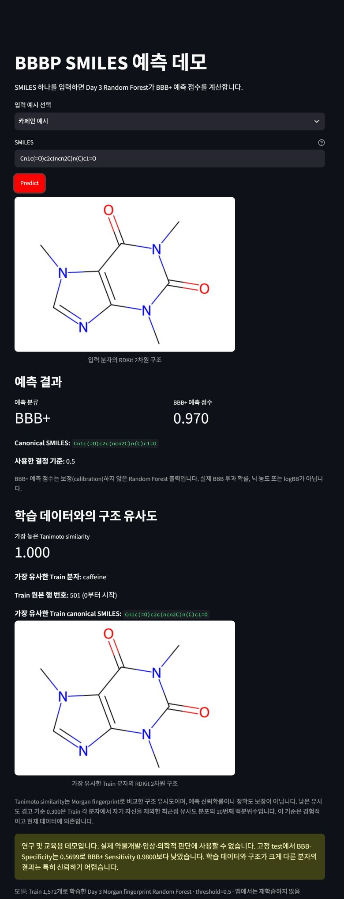

# BBBP 프로젝트 1~6일 차 전체 실험 기록

이 문서는 데이터 점검부터 모델 비교, 앱과 재현성 검증까지의 상세 과정을 보존합니다. 프로젝트 핵심 소개와 빠른 실행 방법은 [README](../README.md)에서 확인할 수 있습니다.

이 저장소는 SMILES에서 계산한 분자 특성을 이용해 혈액-뇌 장벽(BBB) 투과 여부를 예측하는 학부생용 미니 프로젝트입니다. 모든 설명은 코딩 초보자가 실행 순서와 데이터 처리 이유를 따라갈 수 있도록 한국어로 작성했습니다. 라이브러리명, 파일명, 코드 변수처럼 번역하면 실행이 어려워지는 고유 이름은 원문을 함께 표시합니다.

## 연구 질문

해석 가능한 RDKit 분자 기술자(descriptor)를 사용하는 로지스틱 회귀(Logistic Regression)와 Morgan 분자 지문(fingerprint)을 사용하는 랜덤 포레스트(Random Forest) 중 어느 접근이 MoleculeNet BBBP 데이터에서 더 좋은 분류 성능을 보이는지 비교합니다.

1일 차에는 데이터 구조와 RDKit 해석 가능 여부를 확인했고, 2일 차에는 모델용 데이터 선정 기준과 특성 생성 방법을 정했습니다. 3일 차에는 클래스 비율을 유지하는 층화 학습·시험 분할(stratified train-test split) 후 세 기준모델을 학습하고, 따로 보관한 시험 데이터에서 최종 평가했습니다. 4일 차에는 3일 차 결과를 먼저 재현한 뒤 시험 데이터를 제외한 학습 데이터만으로 5겹 교차검증을 하고 랜덤 포레스트의 시험 데이터 오류를 분석했습니다.

## 데이터

- 데이터셋: MoleculeNet BBBP
- 정답 열: `p_np` (`1` = BBB+, `0` = BBB-)
- 구조 표현: `smiles`
- 공식 다운로드 URL: DeepChem의 `load_bbbp`가 사용하는 공개 CSV
- 원 논문: Martins et al. (2012), *A Bayesian Approach to in Silico Blood-Brain Barrier Penetration Modeling*

원본 CSV는 저장소에 포함하지 않습니다. 노트북이 실행될 때 [DeepChem BBBP loader](https://github.com/deepchem/deepchem/blob/master/deepchem/molnet/load_function/bbbp_datasets.py)에 명시된 URL에서 메모리로 읽습니다. 데이터 자체의 명확한 재배포 라이선스는 확인한 공식 페이지에 표시되어 있지 않아, 공개 GitHub에는 코드·출처·분석 결과만 올리고 원본 파일은 커밋하지 않습니다. 원 데이터 논문 DOI는 <https://doi.org/10.1021/ci300124c>입니다.

## 1일 차: 데이터 확인 방법

1. 공식 CSV를 pandas 데이터프레임(DataFrame)으로 불러왔습니다.
2. 데이터 크기, 열 이름, 클래스 비율과 결측값을 확인했습니다.
3. RDKit `Chem.MolFromSmiles`로 모든 SMILES의 기본 파싱을 시도했습니다.
4. 실패 행은 삭제하거나 수정하지 않고 RDKit 오류 문장과 함께 별도 CSV로 저장했습니다.
5. 파싱에 성공한 BBB+와 BBB-에서 각각 6개를 `random_state=42`로 선택해 시각화했습니다.

## 검증된 1일 차 결과

| 항목 | 결과 |
|---|---:|
| 데이터 크기 | 2,050행 × 4열 |
| 열 이름 | `num`, `name`, `p_np`, `smiles` |
| BBB+ | 1,567개 (76.44%) |
| BBB- | 483개 (23.56%) |
| 전체 결측값 | 0개 |
| RDKit 파싱 성공 | 2,039개 |
| RDKit 파싱 실패 | 11개 (0.54%) |

11개 실패는 모두 질소 원자의 명시적 원자가가 RDKit의 허용 범위를 넘었다는 오류였습니다. 오늘은 원본 표기나 라벨을 임의로 고치지 않았고 2,050개 행을 모두 유지했습니다. 이후 모델링 단계에서는 이 실패 행을 어떻게 처리할지 근거와 함께 별도로 결정해야 합니다.

생성된 결과 파일은 다음과 같습니다.

- `results/day1_data_summary.csv`: 위 핵심 수치
- `results/day1_failed_smiles.csv`: 실패한 11개 행과 개별 오류 원인
- `results/day1_bbb_examples.png`: BBB+ 6개와 BBB- 6개 예시 구조

## 2일 차: 모델용 데이터 선정 기준

원본 BBBP 2,050행은 `original_df`에 그대로 유지합니다. RDKit이 해석하지 못한 11개는 원본에서 삭제된 것으로 표현하지 않고, 분자 기술자와 분자 지문을 계산할 수 없어 **모델 학습 대상에서 제외**한 것으로 기록했습니다.

파싱에 성공한 2,039개 분자는 `Chem.MolToSmiles(..., canonical=True, isomericSmiles=True)`로 canonical SMILES를 만들었습니다. Canonical SMILES는 같은 분자를 일정한 규칙으로 다시 작성한 대표 문자열이며, 원본에 입체화학 정보가 있으면 가능한 범위에서 유지합니다. 생성 실패는 0건이었습니다.

정규화 SMILES(canonical SMILES) 기준 처리 원칙은 다음과 같습니다.

- 동일 구조·동일 라벨 중복: 원본 순서에서 첫 행 하나만 유지
- 동일 구조·서로 다른 라벨: 어느 라벨이 맞는지 임의로 결정하지 않고 해당 그룹 전체를 모델 대상에서 제외
- 원본 데이터프레임과 중복·충돌 확인용 CSV는 그대로 유지

## 검증된 2일 차 데이터 처리 결과

| 항목 | 결과 |
|---|---:|
| 원본 행 | 2,050 |
| RDKit 파싱 성공 | 2,039 |
| 파싱 실패로 모델 대상에서 제외 | 11 |
| Canonical SMILES 생성 실패 | 0 |
| Canonical SMILES 중복 그룹 | 60개 |
| 중복 그룹 관련 행 | 124개 |
| 동일 라벨 중복 그룹 | 50개 |
| 동일 라벨 중복으로 제외 | 54행 |
| 라벨 충돌 그룹 | 10개 |
| 라벨 충돌로 제외 | 20행 |
| 최종 모델용 분자 | 1,965개 |
| 최종 BBB+ | 1,500개 (76.34%) |
| 최종 BBB- | 465개 (23.66%) |

다음 관계를 노트북의 `assert` 문으로 확인했습니다.

```text
2,050 = 파싱 실패 11 + 동일 라벨 중복 제외 54 + 충돌 제외 20 + 최종 모델용 1,965
```

## 2일 차: 분자 특성

로지스틱 회귀에 사용할 해석 가능한 분자 기술자는 다음 8개로 제한했습니다.

- `MolWt`: 분자량
- `MolLogP`: 지용성
- `TPSA`: 극성 표면적
- `NumHDonors`: 수소 결합 공여체 수
- `NumHAcceptors`: 수소 결합 수용체 수
- `NumRotatableBonds`: 회전 가능한 결합 수
- `RingCount`: 고리 수
- `FractionCSP3`: 탄소 중 sp³ 탄소의 비율

분자 기술자 행렬은 `(1965, 8)`이며 결측 수치(NaN)와 무한대가 없고 모든 열이 숫자형임을 확인했습니다. BBB+와 BBB-의 MolWt, MolLogP, TPSA 분포 및 8개 분자 기술자의 피어슨(Pearson) 상관관계를 그림으로 저장했습니다. 그래프에서 보이는 차이는 분포 사이의 연관성을 관찰한 것이며 BBB 투과의 원인이라고 해석하지 않습니다.

랜덤 포레스트에 사용할 Morgan 분자 지문은 RDKit의 `rdFingerprintGenerator.GetMorganGenerator`로 생성했습니다.

- `radius=2`
- `fpSize=2048`
- 행렬 크기: `(1965, 2048)`
- 값: 0과 1만 존재

전체 2,048비트 행렬은 저장하지 않습니다. 크기가 크고 3일 차에 동일한 함수로 다시 생성할 수 있기 때문입니다.

2일 차 결과 파일은 다음과 같습니다.

- `results/day2_duplicate_smiles.csv`: 60개 중복 그룹에 속한 124행
- `results/day2_conflicting_labels.csv`: 10개 충돌 그룹에 속한 20행
- `results/day2_data_cleaning_summary.csv`: 데이터 선정 과정의 핵심 개수
- `results/day2_descriptor_summary.csv`: 8개 분자 기술자의 평균·표준편차·최솟값·중앙값·최댓값
- `results/day2_descriptor_distributions.png`: 클래스별 MolWt, MolLogP, TPSA 분포
- `results/day2_descriptor_correlation.png`: 8개 분자 기술자의 상관관계

## 3일 차: 모델 학습과 시험 설계

3일 차 노트북은 2일 차 결과 CSV를 학습 데이터로 읽지 않고, 공식 BBBP 주소부터 동일한 정제 과정을 코드로 다시 실행합니다. 최종 모델용 1,965개를 다음처럼 분할했습니다.

| 구분 | 전체 | BBB- | BBB+ |
|---|---:|---:|---:|
| 전체 | 1,965 | 465 (23.66%) | 1,500 (76.34%) |
| 학습 데이터 | 1,572 | 372 (23.66%) | 1,200 (76.34%) |
| 시험 데이터 | 393 | 93 (23.66%) | 300 (76.34%) |

- 분할 방법: 클래스 비율을 유지하는 층화 80:20 분할
- `random_state=42`
- 같은 정규화 SMILES의 학습·시험 데이터 중복: 0개
- 시험 데이터는 학습과 설정 선택에 사용하지 않고 마지막 평가에서 한 번만 예측

사용한 모델은 다음 세 개입니다.

| 모델 | 입력 특성 | 고정 설정 |
|---|---|---|
| 더미 분류기(`DummyClassifier`) | 입력을 무시 | `strategy=most_frequent` |
| 로지스틱 회귀 | 8개 RDKit 분자 기술자 | `StandardScaler`, `max_iter=1000` |
| 랜덤 포레스트 | Morgan 분자 지문 | `radius=2`, `fpSize=2048`, `n_estimators=300` |

로지스틱 회귀의 `StandardScaler`는 파이프라인(Pipeline) 안에서 학습 데이터의 분자 기술자에만 맞춤(`fit`)했습니다. 랜덤 포레스트를 포함해 복잡한 하이퍼파라미터 탐색은 하지 않았습니다.

## 평가 방법

- 정확도(Accuracy): 전체 시험 예측 중 맞힌 비율
- F1 점수(F1-score): BBB+에 대한 정밀도와 재현율의 조화평균
- ROC-AUC: 모든 분류 기준에서 BBB+를 BBB-보다 높게 점수화하는 능력
- 혼동행렬(confusion matrix): 실제·예측 클래스별 정답과 오류 개수
- ROC 곡선: 위양성률에 따른 진양성률 변화

BBB+가 많은 불균형 데이터이므로 정확도 하나만으로 모델을 판단하지 않고 F1 점수, ROC-AUC와 혼동행렬을 함께 확인했습니다.

## 검증된 3일 차 시험 결과

아래 값은 `random_state=42`인 한 번의 층화 무작위 분할에서 시험 데이터 393개를 평가한 실제 결과입니다.

| 모델 | 입력 | 정확도 | F1 점수 | ROC-AUC |
|---|---|---:|---:|---:|
| 더미 분류기 | 입력 무시 | 0.7634 | 0.8658 | 0.5000 |
| 로지스틱 회귀 | 8개 분자 기술자 | 0.8550 | 0.9100 | 0.8475 |
| 랜덤 포레스트 | Morgan 분자 지문 | 0.8830 | 0.9274 | 0.8960 |

혼동행렬에서 확인된 내용은 다음과 같습니다.

- 더미 분류기: BBB- 0/93개, BBB+ 300/300개 정답
- 로지스틱 회귀: BBB- 48/93개, BBB+ 288/300개 정답
- 랜덤 포레스트: BBB- 53/93개, BBB+ 294/300개 정답

이번 분할에서는 Morgan 분자 지문 기반 랜덤 포레스트가 세 지표 모두 가장 높았습니다. 그러나 이 결과만으로 랜덤 포레스트가 모든 BBB 데이터에서 항상 더 좋다고 결론 내릴 수는 없습니다. 더미 분류기의 정확도와 F1 점수가 높아 보이는 이유도 모든 분자를 다수 클래스인 BBB+로 예측했기 때문이므로 ROC-AUC와 혼동행렬을 함께 봐야 합니다.

3일 차 결과 파일은 다음과 같습니다.

- `results/day3_split_summary.csv`: 전체·학습·시험 데이터의 클래스 분포
- `results/day3_model_metrics.csv`: 세 모델의 정확도, F1 점수, ROC-AUC
- `results/day3_confusion_matrices.png`: 세 모델의 혼동행렬
- `results/day3_roc_curves.png`: 세 모델의 ROC 곡선

## 4일 차: 추가 검증 설계

3일 차의 고정 시험 평가는 **한 번 정한 시험 데이터 393개에서 얻은 최종 성능**이고, 4일 차의 교차검증은 **시험 데이터를 완전히 제외한 학습 데이터 1,572개 안에서 얻은 성능의 평균과 변동**입니다. 두 결과는 목적과 사용한 분자가 다르므로 같은 값일 필요는 없습니다.

먼저 3일 차의 데이터 정제, 분할, 특징과 모델을 똑같이 다시 생성했습니다. 학습·시험 데이터의 행 순서와 정규화 SMILES 순서·집합의 SHA-256 해시, 클래스 수, 세 모델의 시험 정확도·F1·ROC-AUC와 혼동행렬이 모두 3일 차와 일치해야 다음 단계가 실행되도록 `assert` 문으로 확인했습니다.

교차검증 설정은 다음과 같습니다.

- 대상: 3일 차 학습 데이터 1,572개만 사용하고 시험 데이터 393개는 모든 폴드에서 제외
- 방법: `StratifiedKFold(n_splits=5, shuffle=True, random_state=42)`
- 공정한 비교: 세 모델이 정확히 같은 다섯 폴드를 사용
- 로지스틱 회귀: `StandardScaler`를 각 폴드의 훈련 부분에만 맞추는 파이프라인 유지
- 모델·특징·하이퍼파라미터: 3일 차와 동일
- 예측 결정 기준: 0.5 유지
- 성능 향상용 모델 추가, 하이퍼파라미터 탐색, 임계값 조정: 수행하지 않음

교차검증은 학습 데이터를 다섯 조각으로 나누고, 한 조각을 검증용으로 바꾸어 가며 다섯 번 평가하는 방법입니다. 아래 `평균 ± 표준편차`에서 평균은 다섯 평가의 중심값이고, 표준편차는 폴드에 따라 점수가 얼마나 달라졌는지를 나타냅니다.

## 검증된 4일 차 학습 데이터 전용 5겹 교차검증 결과

| 모델 | 정확도 | F1 | ROC-AUC | PR-AUC | 균형 정확도 | MCC | 민감도 | 특이도 |
|---|---:|---:|---:|---:|---:|---:|---:|---:|
| 더미 분류기 | 0.7634 ± 0.0013 | 0.8658 ± 0.0009 | 0.5000 ± 0.0000 | 0.7634 ± 0.0013 | 0.5000 ± 0.0000 | 0.0000 ± 0.0000 | 1.0000 ± 0.0000 | 0.0000 ± 0.0000 |
| 로지스틱 회귀 | 0.8403 ± 0.0158 | 0.9018 ± 0.0092 | 0.8481 ± 0.0192 | 0.9325 ± 0.0120 | 0.7073 ± 0.0291 | 0.5099 ± 0.0560 | 0.9600 ± 0.0070 | 0.4545 ± 0.0562 |
| 랜덤 포레스트 | 0.8893 ± 0.0215 | 0.9308 ± 0.0129 | 0.9237 ± 0.0326 | 0.9697 ± 0.0154 | 0.7950 ± 0.0419 | 0.6744 ± 0.0681 | 0.9742 ± 0.0104 | 0.6158 ± 0.0828 |

랜덤 포레스트의 폴드별 ROC-AUC 범위는 0.8895~0.9638이었고, ROC-AUC 기준으로 5개 폴드 모두 세 모델 중 가장 높았습니다. 3일 차 고정 시험 ROC-AUC 0.8960은 이 범위의 최솟값과 최댓값 사이에 있습니다. 그렇더라도 이 결과만으로 모든 외부 데이터에서 랜덤 포레스트가 항상 가장 좋다고 말할 수는 없습니다.

더미 분류기의 정확도와 BBB+ F1 점수가 높아 보이는 이유는 학습 데이터의 약 76%인 다수 클래스 BBB+로 모든 분자를 예측하기 때문입니다. 이 모델의 특이도와 MCC는 0이고 균형 정확도는 0.5입니다. 따라서 클래스 불균형이 있는 이 데이터에서는 정확도·F1과 함께 균형 정확도, MCC, 민감도, 특이도를 확인해야 합니다.

## 검증된 4일 차 고정 시험 데이터 확장 지표

3일 차에서 사용한 동일한 시험 예측에 지표만 추가했으며, 다시 모델을 선택하거나 분류 기준을 조정하지 않았습니다.

| 모델 | 정확도 | 정밀도 | F1 | ROC-AUC | PR-AUC | 균형 정확도 | MCC | 민감도 | 특이도 |
|---|---:|---:|---:|---:|---:|---:|---:|---:|---:|
| 더미 분류기 | 0.7634 | 0.7634 | 0.8658 | 0.5000 | 0.7634 | 0.5000 | 0.0000 | 1.0000 | 0.0000 |
| 로지스틱 회귀 | 0.8550 | 0.8649 | 0.9100 | 0.8475 | 0.9266 | 0.7381 | 0.5626 | 0.9600 | 0.5161 |
| 랜덤 포레스트 | 0.8830 | 0.8802 | 0.9274 | 0.8960 | 0.9496 | 0.7749 | 0.6543 | 0.9800 | 0.5699 |

랜덤 포레스트의 시험 정확도와 균형 정확도 차이는 0.1080이었습니다. 혼동행렬은 TN 53, FP 40, FN 6, TP 294였으므로 오류 46개 중 FP가 FN보다 많았습니다. 이 시험에서는 BBB+를 찾는 민감도 0.9800이 BBB-를 찾는 특이도 0.5699보다 높았습니다. 세 모델 중 BBB-를 가장 높은 비율로 맞힌 모델도 특이도 기준 랜덤 포레스트였습니다.

FP와 FN 전체는 원본 식별자, SMILES, 실제·예측 라벨, BBB+ 점수와 8개 분자 기술자를 포함한 CSV로 저장했습니다. BBB+ 점수가 가장 높은 FP 6개와 가장 낮은 FN 6개는 분자 구조 그림으로 만들었습니다. TN/FP/FN/TP별 분자 기술자 평균·중앙값과 MolWt·MolLogP·TPSA 분포도 함께 기록했지만, 관찰된 차이를 BBB 투과 또는 오류의 원인으로 해석하지 않습니다. 특히 FN은 6개뿐이라 요약값이 쉽게 달라질 수 있습니다.

4일 차 결과 파일은 다음과 같습니다.

- `results/day4_cv_fold_metrics.csv`: 모델·폴드별 8개 지표와 혼동행렬 수치
- `results/day4_cv_summary.csv`: 지표별 평균, 표준편차, 최솟값, 최댓값
- `results/day4_cv_comparison.png`: 주요 지표의 5겹 평균 ± 표준편차
- `results/day4_test_metrics_extended.csv`: 고정 시험 데이터의 확장 지표
- `results/day4_random_forest_test_errors.csv`: 랜덤 포레스트 FP/FN 46개
- `results/day4_high_confidence_errors.png`: 확신도가 높은 FP/FN 각 6개 구조
- `results/day4_error_descriptor_summary.csv`: TN/FP/FN/TP별 8개 분자 기술자 평균·중앙값
- `results/day4_error_descriptor_comparison.png`: MolWt, MolLogP, TPSA 분포 비교

## 5일 차: 재현 가능한 SMILES 예측 데모

5일 차에는 모델을 추가하거나 성능을 다시 비교하지 않고, 3일 차에서 평가한 **동일한 랜덤 포레스트를 재현해 저장하고 새 SMILES 하나를 예측하는 과정**을 만들었습니다.



SMILES를 입력하면 BBB 투과 예측과 함께 가장 유사한 학습 분자 및 타니모토 유사도(Tanimoto similarity)를 표시합니다. 유사도는 예측 정확도나 신뢰확률을 보장하지 않습니다. 위 화면의 카페인은 앱 작동 예시이며 새로운 성능 근거로 사용하지 않습니다.

앱이 사용하는 모델은 다음 조건으로 만들어졌습니다.

- 학습 데이터: 3일 차 학습 데이터 1,572개만 사용
- 평가 데이터: 3일 차 시험 데이터 393개, 학습에는 포함하지 않음
- 입력 특징: Morgan 비트 벡터, `radius=2`, `fpSize=2048`
- 모델: `RandomForestClassifier(n_estimators=300, random_state=42, n_jobs=-1)`
- 결정 기준: BBB+ 예측 점수가 0.5보다 크면 BBB+, 0.5 동점이면 BBB-
- 저장 전 재현 성능: 정확도 0.8830, F1 0.9274, ROC-AUC 0.8960
- 저장 전 혼동행렬: TN 53, FP 40, FN 6, TP 294
- 저장 후 다시 불러온 분류 예측: 저장 전과 완전히 일치

모델 묶음(bundle)에는 학습된 랜덤 포레스트뿐 아니라 분자 지문 설정, 라벨 의미, 분류 기준, 실제 모델 매개변수, 학습·시험 데이터 수, 데이터 출처와 3일 차 재현 결과가 함께 들어 있습니다. 모델은 압축 후 약 **2.24 MiB**로 GitHub 대용량 파일 제한과 거리가 멀고, 사용자가 데이터 다운로드와 재학습 없이 앱을 확인할 수 있어 `models/bbbp_random_forest.joblib`을 저장소 포함 대상으로 정했습니다. 원본 BBBP CSV는 여전히 포함하지 않습니다.

### 추론 과정

```text
SMILES 입력
→ 빈 값·길이·RDKit 파싱 검사
→ 정규화 SMILES 생성
→ Morgan 분자 지문 (1, 2048) 생성
→ 저장된 랜덤 포레스트로 BBB+ 점수 계산
→ 분류 기준 0.5로 BBB+ 또는 BBB- 표시
```

`src/features.py`가 분자 지문 설정을 한 곳에서 관리하고, `scripts/build_model.py`, `src/predict.py`와 `app.py`가 모두 이 함수를 사용합니다. 빈 문자열, 공백, `None`, 잘못된 SMILES와 4,096자를 넘는 입력은 프로그램을 종료시키지 않고 이해하기 쉬운 오류 메시지로 처리합니다. 자세한 RDKit 해석 기록은 앱 화면에 노출하지 않습니다.

### 모델 생성과 앱 실행

저장소 루트에서 다음 순서로 실행합니다. 아래 명령은 현재 Python 3.12.13 가상환경에서 실제로 실행해 확인했습니다.

```powershell
.\.venv\Scripts\Activate.ps1
python -m pip install -r requirements.txt
python scripts\build_model.py
python scripts\build_similarity_reference.py
python scripts\smoke_test.py
python -m streamlit run app.py
```

`build_model.py`는 공식 BBBP 주소부터 2일 차 정제와 3일 차 분할을 재현합니다. 3일 차 시험 지표와 혼동행렬이 일치할 때만 `models/bbbp_random_forest.joblib`을 저장하고, 다시 불러온 예측도 검사합니다. 따라서 모델을 다시 만들 때 인터넷 연결이 필요합니다. 저장된 모델이 이미 있으면 앱의 단일 SMILES 예측 자체에는 BBBP 다운로드가 필요하지 않습니다.

Streamlit이 표시한 로컬 주소(일반적으로 `http://localhost:8501`)를 브라우저에서 엽니다. 앱은 `Predict` 버튼을 누르기 전에는 예측하지 않습니다. 이 버튼 이름은 실제 앱 화면과 일치하도록 영어 원문을 유지했습니다.

입력 예시는 다음과 같습니다.

- 에탄올: `CCO`
- 아세트산: `CC(=O)O`
- 카페인: `Cn1c(=O)c2c(ncn2C)n(C)c1=O`

앱은 정규화 SMILES, RDKit 2차원 구조, BBB+/BBB- 분류, BBB+ 예측 점수와 사용한 분류 기준을 보여줍니다. 6일 차부터는 가장 유사한 학습 분자의 이름·정규화 SMILES·2차원 구조와 타니모토 유사도도 함께 표시합니다. 잘못된 SMILES에는 “유효한 SMILES로 해석할 수 없습니다”와 같은 메시지를 표시하며 앱은 계속 실행됩니다.

### 예측 점수의 의미와 면책문구

BBB+ 예측 점수는 랜덤 포레스트의 `predict_proba` 출력이지만 별도의 확률 보정(calibration)을 하지 않았습니다. 따라서 **실제 BBB 투과확률, 뇌 농도 또는 logBB로 해석할 수 없습니다.** 순위와 0.5 기준 분류에 사용하는 모델 점수입니다.

이 앱은 연구 및 교육용 데모입니다. 실제 약물개발, 임상 또는 의학적 판단에 사용할 수 없습니다. 고정 시험에서 BBB+ 민감도는 0.9800이었지만 BBB- 특이도는 0.5699로 낮았습니다. 즉 BBB-를 BBB+로 판단한 FP가 40개였으며, 학습 데이터와 구조가 크게 다른 분자에는 결과를 더욱 신뢰하기 어렵습니다.

## 6일 차: 제한적인 모델 개선 비교

### 왜 정확도 이외의 지표도 확인했나

최종 모델용 데이터에는 BBB+가 더 많습니다. 따라서 다수 클래스인 BBB+를 주로 맞히면 정확도와 F1 점수가 높게 보일 수 있지만, BBB-를 제대로 구분하는지는 충분히 드러나지 않습니다. 실제 3일 차 랜덤 포레스트도 고정 시험에서 민감도는 0.9800이었지만 특이도는 0.5699였고, BBB- 93개 중 40개를 BBB+로 잘못 분류했습니다.

6일 차의 개선 목표는 다음 세 값을 함께 높이는 것이었습니다.

- **특이도(Specificity):** 실제 BBB- 중 BBB-로 맞힌 비율
- **균형 정확도(Balanced Accuracy):** 민감도와 특이도의 평균
- **MCC:** 두 클래스의 정답·오답을 함께 반영하는 균형 지표

민감도가 지나치게 낮아지는 것도 막기 위해 평균 민감도 0.95 이상을 조건으로 두었습니다.

### 비교한 후보와 검증 방법

후보는 아래 세 개로 제한했습니다. 다른 하이퍼파라미터, 분류 기준과 모델은 탐색하지 않았습니다.

- **후보 A — 기존 기준모델:** Morgan 2,048비트, `radius=2`, 기존 랜덤 포레스트 설정
- **후보 B — 클래스 가중치 모델:** 후보 A와 같고 `class_weight="balanced"`만 추가
- **후보 C — 결합 특징 모델:** Morgan 2,048비트 뒤에 2일 차의 분자 기술자 8개를 붙인 총 2,056개 특징, 후보 A와 같은 랜덤 포레스트

세 후보는 3일 차와 같은 학습 데이터 1,572개만 사용했습니다. `StratifiedKFold(n_splits=5, shuffle=True, random_state=42)`로 만든 **동일한 다섯 폴드**를 재사용했고 분류 기준은 모두 0.5였습니다. 기존 시험 데이터 393개의 원본 인덱스가 폴드에 포함되지 않았음을 `assert` 문으로 확인했으며, 새 후보를 기존 시험 데이터에 적용하지 않았습니다.

### 실제 학습 데이터 전용 5겹 교차검증 결과

아래 값은 다섯 폴드의 **평균 ± 표준편차**입니다.

| 후보 | 정확도 | F1 | ROC-AUC | PR-AUC | 균형 정확도 | MCC | 민감도 | 특이도 |
|---|---:|---:|---:|---:|---:|---:|---:|---:|
| A: 기존 RF | 0.8893 ± 0.0215 | 0.9308 ± 0.0129 | 0.9237 ± 0.0326 | 0.9697 ± 0.0154 | 0.7950 ± 0.0419 | 0.6744 ± 0.0681 | 0.9742 ± 0.0104 | 0.6158 ± 0.0828 |
| B: 클래스 균형 RF | 0.8982 ± 0.0280 | 0.9347 ± 0.0175 | 0.9286 ± 0.0307 | 0.9734 ± 0.0127 | 0.8378 ± 0.0505 | 0.7076 ± 0.0850 | 0.9525 ± 0.0137 | 0.7231 ± 0.0951 |
| C: Morgan과 분자 기술자 결합 RF | 0.8957 ± 0.0217 | 0.9346 ± 0.0132 | 0.9303 ± 0.0253 | 0.9735 ± 0.0098 | 0.8075 ± 0.0418 | 0.6952 ± 0.0672 | 0.9750 ± 0.0128 | 0.6401 ± 0.0833 |

### 사전에 정한 판정 기준과 결과

결과를 계산하기 전에 후보 A보다 평균 균형 정확도, MCC와 특이도가 모두 높고 평균 민감도가 0.95 이상일 때만 “개선 후보”라고 정했습니다. 후보 B와 C가 모두 네 조건을 충족했습니다. 두 후보가 통과하면 균형 정확도를 먼저 비교한다는 규칙에 따라 **후보 B를 학습 데이터 전용 개선 후보**로 정했습니다.

학습 제외 예측(OOF)의 혼동행렬 개수는 다음과 같습니다. 각 분자는 자신을 학습하지 않은 폴드 모델에서만 예측을 받았습니다.

| 후보 | TN | FP | FN | TP | A 대비 FP 감소 | A 대비 FN 증가 |
|---|---:|---:|---:|---:|---:|---:|
| A: 기존 RF | 229 | 143 | 31 | 1,169 | 0 | 0 |
| B: 클래스 균형 RF | 269 | 103 | 57 | 1,143 | 40 | 26 |
| C: Morgan과 분자 기술자 결합 RF | 238 | 134 | 30 | 1,170 | 9 | -1 |

후보 B는 BBB- 오분류인 FP를 더 많이 줄였지만 BBB+ 오분류인 FN이 늘었습니다. 즉 특이도 개선과 민감도 감소가 함께 나타난 상충관계(trade-off)입니다. 후보 C는 변화가 더 작고 민감도는 유지됐지만 균형 정확도와 특이도 개선 폭도 B보다 작았습니다. 이 비교는 통계적 유의성을 검증한 것이 아니며 새 데이터에서도 같은 차이가 난다고 말할 수 없습니다.

### 왜 앱 모델을 자동 교체하지 않았나

기존 앱 모델은 3일 차의 봉인된 시험 데이터에서 한 번 평가한 모델입니다. 반면 후보 B와 C는 학습 데이터 내부 교차검증에서만 비교했습니다. 이미 본 기존 시험 데이터를 새 후보 선택과 재평가에 반복 사용하면 시험 결과가 낙관적으로 변할 수 있습니다. 따라서 **앱의 모델 가중치, 분류 기준과 3일 차 성능 기록을 그대로 유지**했습니다. 새 후보를 최종 배포하려면 기존 시험 데이터와 겹치지 않는 새로운 미사용 평가자료 또는 외부 데이터 검증이 필요합니다.

## 6일 차: 앱의 구조 유사도 안내

앱은 입력 분자의 Morgan 분자 지문을 기존 학습 분자 1,572개의 분자 지문과 비교하고 가장 높은 **타니모토 유사도(Tanimoto similarity)**를 표시합니다. 이 값은 두 분자 지문에서 함께 켜진 비트가 얼마나 겹치는지를 나타내는 구조 유사도이며, 예측 신뢰확률·정확도·BBB 투과확률이 아닙니다.

임의의 0.5 또는 0.7을 경고 기준으로 정하지 않았습니다. 학습 데이터의 각 분자에서 자기 자신을 제외한 가장 가까운 다른 학습 분자의 유사도를 계산했고, 실제 분포는 다음과 같았습니다.

| 통계 | 타니모토 유사도 |
|---|---:|
| 최솟값 | 0.1081 |
| 10번째 백분위수 | 0.3000 |
| 중앙값 | 0.5714 |
| 90번째 백분위수 | 0.8087 |
| 최댓값 | 1.0000 |

입력의 최대 학습 데이터 유사도가 이 분포의 10번째 백분위수인 0.3000보다 낮으면 “학습 데이터의 일반적인 구조 유사도 범위보다 낮다”는 주의 문구를 표시합니다. 이 기준은 현재 학습 데이터에 의존하는 경험적 경고선이며 신뢰수준 90% 같은 뜻이 아닙니다.

앱에 필요한 학습 분자 이름, 원본 행 번호, 정규화 SMILES, Morgan 분자 지문과 경고 기준은 `models/bbbp_train_similarity_reference.joblib`에 압축 저장했습니다. 크기는 약 0.20 MiB이고 전체 2,048비트 행렬을 CSV로 저장하지 않았습니다. 학습 데이터에 포함된 정규화 SMILES를 입력했을 때 최대 유사도 1.0, 모든 유사도 범위 0~1, 자기 자신 제외, 잘못된 SMILES 처리와 기존 고정 예시 점수 불변을 실제 간단 작동 검사(smoke test)로 확인했습니다.

6일 차 상세 결과는 다음 파일에 있습니다.

- `notebooks/06_train_only_model_improvement.ipynb`: 세 후보 비교, OOF 오류와 유사도 기준 생성
- `results/day6_candidate_cv_fold_metrics.csv`: 후보별·폴드별 8개 지표
- `results/day6_candidate_cv_summary.csv`: 평균·표준편차·최솟값·최댓값
- `results/day6_candidate_cv_confusion_counts.csv`: 폴드별 TN, FP, FN, TP
- `results/day6_oof_confusion_summary.csv`: 학습 제외 예측(OOF)의 오류 변화
- `results/day6_candidate_metric_comparison.png`: 주요 개선 지표 비교
- `results/day6_sensitivity_specificity_tradeoff.png`: 민감도와 특이도의 상충관계
- `results/day6_oof_confusion_matrices.png`: 후보별 OOF 혼동행렬
- `results/day6_preexisting_file_sha256.csv`: 기존 노트북·결과·모델 파일 해시

## 실행 방법

Python 3.12.13에서 전체 실행을 확인했습니다. 인터넷 연결이 필요합니다.

Windows PowerShell 기준:

```powershell
python -m venv .venv
.\.venv\Scripts\Activate.ps1
python -m pip install -r requirements.txt
jupyter notebook
```

Jupyter 화면에서 원하는 노트북을 열고 **Restart Kernel and Run All Cells**를 실행합니다. 이 메뉴 이름은 Jupyter 화면과 일치하도록 영어 원문을 유지했습니다. 1일 차 노트북을 명령 한 번으로 전체 재실행하려면 저장소 루트에서 다음을 사용합니다.

```powershell
python -m jupyter nbconvert --to notebook --execute --inplace --ExecutePreprocessor.timeout=300 notebooks\01_data_exploration.ipynb
```

2일 차 전체 재실행 명령은 다음과 같습니다.

```powershell
python -m jupyter nbconvert --to notebook --execute --inplace --ExecutePreprocessor.timeout=300 notebooks\02_feature_engineering.ipynb
```

3일 차 전체 재실행 명령은 다음과 같습니다.

```powershell
python -m jupyter nbconvert --to notebook --execute --inplace --ExecutePreprocessor.timeout=300 notebooks\03_model_training.ipynb
```

4일 차 전체 재실행 명령은 다음과 같습니다.

```powershell
python -m jupyter nbconvert --to notebook --execute --inplace --ExecutePreprocessor.timeout=900 notebooks\04_model_validation_and_error_analysis.ipynb
```

6일 차 전체 재실행 명령은 다음과 같습니다. 이 노트북이 앱용 유사도 참조자료도 다시 만듭니다.

```powershell
python -m jupyter nbconvert --to notebook --execute --inplace --ExecutePreprocessor.timeout=600 notebooks\06_train_only_model_improvement.ipynb
```

유사도 참조자료만 공식 데이터부터 다시 만들려면 다음을 실행합니다.

```powershell
python scripts\build_similarity_reference.py
```

### 권한 오류가 발생할 때

검증 중 Codex 샌드박스가 사용자 홈의 `.ipython`과 Matplotlib 캐시 폴더에 쓰지 못해 `WinError 5`가 한 번 발생했습니다. 패키지나 노트북 코드 오류는 아니었으며, 아래처럼 캐시와 Jupyter 설정 경로를 Git에서 제외된 `work/`로 지정한 뒤 해결했습니다. 일반 로컬 환경에서는 보통 필요하지 않습니다.

```powershell
$env:MPLCONFIGDIR = "$PWD\work\matplotlib-cache"
$env:IPYTHONDIR = "$PWD\work\ipython"
$env:JUPYTER_CONFIG_DIR = "$PWD\work\jupyter-config"
$env:JUPYTER_DATA_DIR = "$PWD\work\jupyter-data"
$env:JUPYTER_RUNTIME_DIR = "$PWD\work\jupyter-runtime"
```

## 폴더 구조

```text
.
├── app.py
├── LICENSE
├── MODEL_CARD.md
├── docs/
│   ├── REPRODUCIBILITY.md
│   └── images/
│       └── bbbp_streamlit_demo.png
├── models/
│   ├── bbbp_random_forest.joblib
│   └── bbbp_train_similarity_reference.joblib
├── notebooks/
│   ├── 01_data_exploration.ipynb
│   ├── 02_feature_engineering.ipynb
│   ├── 03_model_training.ipynb
│   ├── 04_model_validation_and_error_analysis.ipynb
│   └── 06_train_only_model_improvement.ipynb
├── results/
│   ├── day1_bbb_examples.png
│   ├── day1_data_summary.csv
│   ├── day1_failed_smiles.csv
│   ├── day2_conflicting_labels.csv
│   ├── day2_data_cleaning_summary.csv
│   ├── day2_descriptor_correlation.png
│   ├── day2_descriptor_distributions.png
│   ├── day2_descriptor_summary.csv
│   ├── day2_duplicate_smiles.csv
│   ├── day3_confusion_matrices.png
│   ├── day3_model_metrics.csv
│   ├── day3_roc_curves.png
│   ├── day3_split_summary.csv
│   ├── day4_cv_comparison.png
│   ├── day4_cv_fold_metrics.csv
│   ├── day4_cv_summary.csv
│   ├── day4_error_descriptor_comparison.png
│   ├── day4_error_descriptor_summary.csv
│   ├── day4_high_confidence_errors.png
│   ├── day4_random_forest_test_errors.csv
│   ├── day4_test_metrics_extended.csv
│   ├── day6_candidate_cv_confusion_counts.csv
│   ├── day6_candidate_cv_fold_metrics.csv
│   ├── day6_candidate_cv_summary.csv
│   ├── day6_candidate_metric_comparison.png
│   ├── day6_oof_confusion_matrices.png
│   ├── day6_oof_confusion_summary.csv
│   ├── day6_preexisting_file_sha256.csv
│   └── day6_sensitivity_specificity_tradeoff.png
├── scripts/
│   ├── build_model.py
│   ├── build_similarity_reference.py
│   └── smoke_test.py
├── src/
│   ├── __init__.py
│   ├── features.py
│   ├── predict.py
│   └── similarity.py
├── .gitignore
├── README.md
└── requirements.txt
```

`.venv`, Python 캐시, 노트북 임시 저장 폴더, 환경변수·비밀정보, 원본 데이터와 로컬 작업 폴더는 `.gitignore`로 제외합니다.

## 독립 재현성 검증

2026-08-25에 기존 프로젝트 `.venv`를 사용하지 않은 새 Python 3.12.13 환경에서 `requirements.txt` 설치, `pip check`, 자동 간단 작동 검사, 저장 모델 불러오기, 정상·빈·잘못된 SMILES 처리, 구조 유사도 기능과 Streamlit HTTP 응답을 확인했습니다. 모든 실행 검사는 통과했습니다.

아직 첫 Git 커밋과 원격 저장소가 없으므로 실제 새 복제(fresh clone) 대신 GitHub 공개 후보 파일만 복사한 격리된 사본에서 검사했습니다. 설치 과정의 Windows 긴 경로 문제와 해결 방법, 실제 출력, 남은 확인 사항은 [독립 재현성 검증 기록](REPRODUCIBILITY.md)에 정리했습니다.

## 라이선스와 데이터 권리

- 이 저장소에서 직접 작성한 코드에는 [MIT License](../LICENSE)가 적용됩니다.
- BBBP 원본 데이터는 이 저장소에 포함하지 않습니다.
- BBBP를 포함한 제3자 데이터와 사용한 라이브러리는 각각의 원래 라이선스 및 이용 조건을 따릅니다.
- 이 저장소의 MIT License는 직접 작성한 코드에 대한 것이며 BBBP 원본 데이터에는 적용되지 않습니다.

## 한계

- 한 번의 층화 무작위 분할 결과이므로 분할이 바뀌면 성능도 달라질 수 있습니다.
- 무작위 분할에서는 화학적으로 유사한 골격(scaffold)이 학습과 시험 데이터에 나뉠 수 있어 골격 기준 분할보다 결과가 낙관적일 수 있습니다.
- 파싱 실패 11행과 라벨 충돌 20행은 외부 근거 없이 구조나 라벨을 임의로 수정하지 않고 모델 대상에서 제외했습니다.
- BBB+가 76.34%로 더 많아 정확도와 F1 점수가 다수 클래스의 영향을 받습니다.
- 하이퍼파라미터 탐색, 확률 보정, 반복 교차검증과 외부 데이터 검증을 하지 않았습니다. 4일 차의 단일 5겹 결과도 다른 폴드 구성에서 달라질 수 있습니다.
- 이 모델은 교육용 기준모델이며 임상 판단이나 실제 약물 개발에 바로 사용할 수 없습니다.
- 저장 모델은 3일 차 학습 데이터 1,572개에만 맞춰졌고, 새로운 화학 공간에 대한 외부 검증이나 확률 보정을 하지 않았습니다.
- 6일 차 개선 후보는 학습 데이터 내부 교차검증에서만 선택했으며 새로운 미사용 시험 데이터 또는 외부 데이터로 최종 성능을 확인하지 않았습니다.
- 타니모토 유사도와 0.3000 경고선은 구조적 익숙함을 알려주는 경험적 보조정보일 뿐 예측 신뢰확률이 아닙니다.

## 다음 단계

핵심 모델 비교, 학습 데이터 전용 5겹 교차검증, 제한적 후보 비교와 단일 SMILES 구조 유사도 안내를 6일 차까지 완료했습니다. 이후 작업은 별도 연구 질문으로 다뤄야 합니다.

- 무작위 분할 결과와 골격 기준 분할 결과의 민감도 비교
- 반복 분할을 통한 성능 변동 확인
- 기존 시험 데이터와 겹치지 않는 외부 BBB 데이터에서 후보 B와 기존 앱 모델을 한 번만 비교

새 기능은 실제 실행을 확인한 뒤에만 README에 추가합니다.
